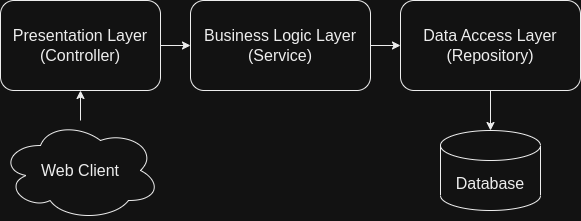
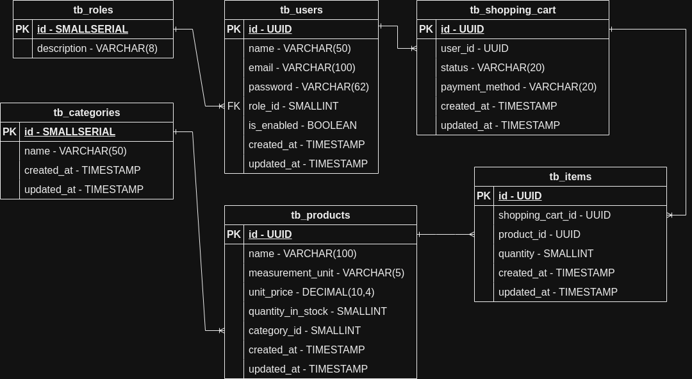

# JuMarket API

Api desenvolvida para resolução do Desafio Bootcamp Kotlin Backend Developer da empresa [TQI](https://tqi.com.br)

### 🔩 Setup inicial

##### Requerimentos:

- [Docker](https://docker.com)
- [Docker Compose Plugin](https://docs.docker.com/compose/)

- Crie um arquivo **.env** na pasta raiz do projeto e adicione as seguintes informações:

  ```bash
  DB_HOST={DATABASE_HOST}
  DB_PORT={DATABASE_PORT}
  DB_NAME={DATABASE_NAME}
  DB_USERNAME={DATABASE_USERNAME}
  DB_PASSWORD={DATABASE_PASSWORD}
  JWT_SECRET_KEY={JWT_SECRET_KEY}
  ```

### 🚀 Construa e execute a aplicação com o seguinte comando:

```bash
./gradlew clean build -x test && docker compose up -d
```

Com a aplicação em execução você pode ver os *endpoints* disponíveis na URL:

```bash
http://localhost/swagger-ui.html
```

### 📐 Arquitetura utilizada no Projeto: Three-layer architecture (Arquitetura de três camadas)



- **Controller:** Esta é a interface do usuário do aplicativo que apresenta os recursos e dados do aplicativo para o usuário.

- **Service:** Essa camada contém a lógica de negócios que orienta as principais funcionalidades do aplicativo. Como tomar decisões, cálculos, avaliações e processar os dados que passam entre as outras duas camadas.

- **Repository:** Essa camada é responsável por interagir com os bancos de dados para salvar e restaurar os dados do aplicativo.


### 💾 Diagrama Relacional do Banco de Dados



